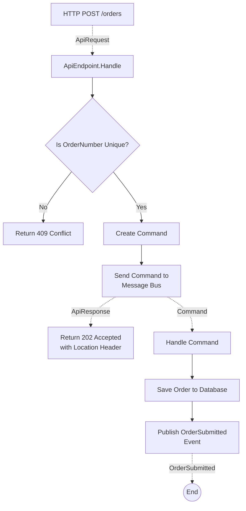
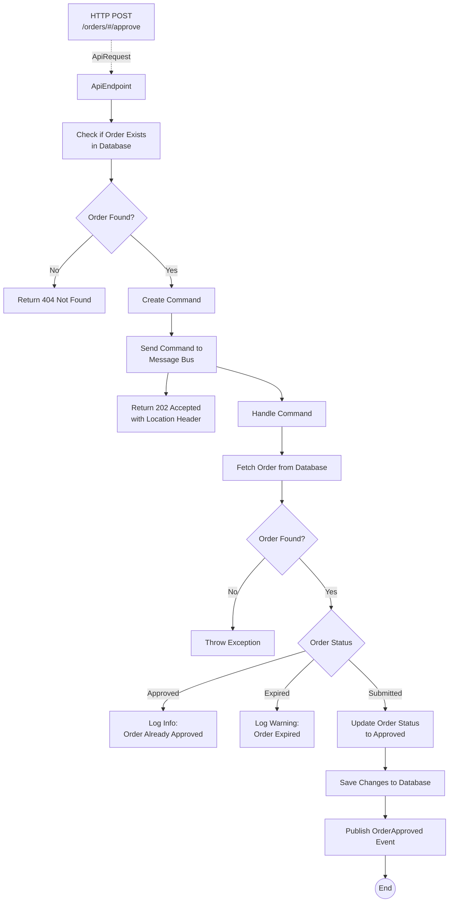
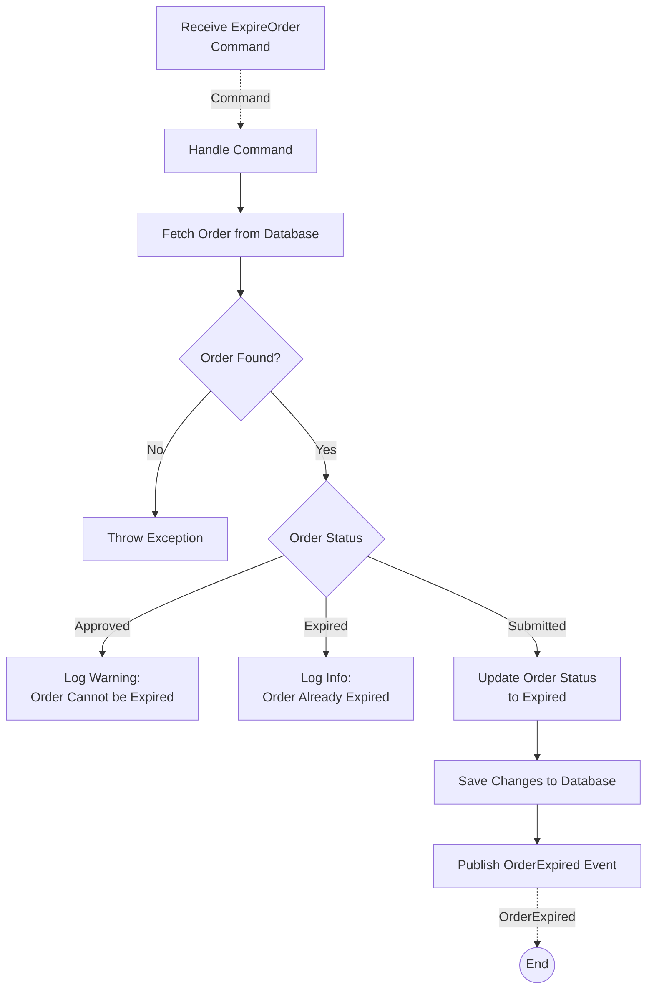
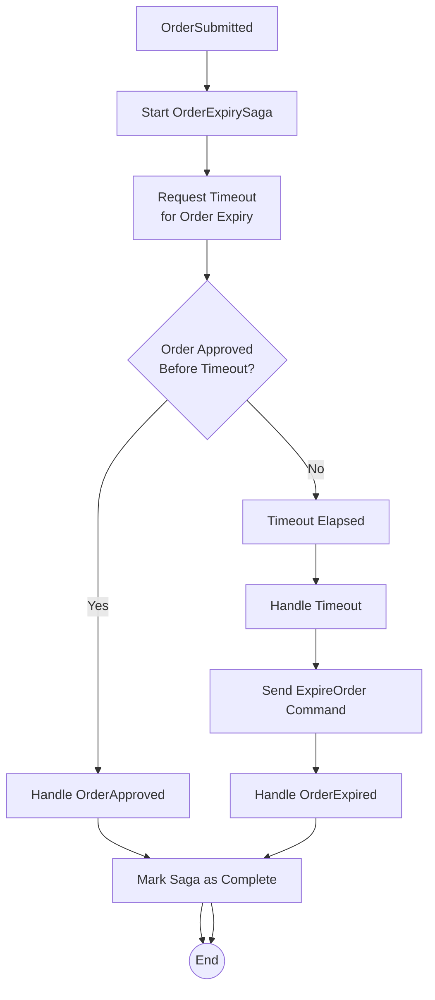

# NServiceBus Demo using .NET 9, Minimal APIs, and Vertical Slice Architecture

## Vertical Slice Architecture

This solution uses the Vertical Slice architecture, where each feature is implemented end-to-end, encapsulating all necessary components, in a single file (using a single folder is another option). This approach contrasts with traditional layered architecture by focusing on delivering complete features rather than separating concerns into distinct layers.

In this solution:

- `ApiEndpoint` classes using HTTP requests, perform validation, and send commands to NServiceBus for asynchronous processing. Minimal APIs are used, along with the fantastic [Carter](https://github.com/CarterCommunity/Carter) library for endpoint discovery.
- `CommandHandler` classes are NServiceBus handlers procesing the various messages dispatched by API endpoints and the `OrderExpirySaga`.
- `OrderExpirySaga` manages the lifecycle of the order, ensuring it is either approved or marked as expired within a specified timeframe.

Each vertical slice, such as submitting an order or handling order expiry, is self-contained, promoting better maintainability, scalability, and a clear separation of concerns. This architecture allows developers to focus on individual features, making the codebase easier to understand and modify.

## Features

### SubmitOrder

The `SubmitOrder` class handles the process of submitting an order through an API endpoint, processing the order, and saving it to the database. Here is a summary of how it works:

#### SubmitOrder.ApiEndpoint

- **Receives an HTTP POST request** to submit an order.
- **Validates the order number** to ensure it is unique.
  - If the order number already exists, it returns a `409 Conflict` response.
- **Sends a command** to the message bus to process the order.
- **Returns a `202 Accepted` response** indicating the order is being processed, with a `Location` header pointing to the order status endpoint.

#### SubmitOrder.CommandHandler

- **Asynchronously handles the command** to process the order.
- **Saves the order to the database**.
- **Publishes an event** indicating the order has been submitted.
- **Error handling** If multiple commands are dispatched by the `ApiEndpoint` for the same `OrderNumber` a `SqlException` will be thrown when saving the Order. NServiceBus retries will kick in to retry the message. Ideally we would have additional validation logic in the `CommandHandler` to prevent this. **Always validate your inputs!** However, I left this here to demonstrate NServiceBus retries. ;)

### SubmitOrder Flow

### ApproveOrder

The `ApproveOrder` class handles the process of approving an order through an API endpoint, processing the approval, and updating the order status in the database. Here is a summary of how it works:

#### ApproveOrder.ApiEndpoint

- **Receives an HTTP POST request** to approve an order.
- **Validates the order number** to ensure the order exists.
  - If the order number does not exist, it returns a `404 Not Found` response.
- **Sends a command** to the message bus to process the order approval.
- **Returns a `202 Accepted` response** indicating the order approval is being processed, with a `Location` header pointing to the order status endpoint.

#### ApproveOrder.CommandHandler

- **Asynchronously handles the command** to approve the order.
- **Fetches the order from the database** using the order number.
  - If the order is not found, an exception is thrown. NServiceBus retries will kick in and retry until hopefully the `SubmitOrder` command is handled creating the order. Remember, you can't guarantee the order of events!
- **Checks the current status of the order**:
  - If the order is already approved, it logs the information and returns.
  - If the order has expired, it logs a warning and returns.
  - If the order is submitted, it updates the status to "Approved", saves the changes to the database, and publishes an `OrderApproved` event.

#### ApproveOrder Flow

### ExpireOrder

The `ExpireOrder` class handles the process of expiring an order by updating its status in the database and publishing an event. Unlike the other two features, there is no Expire Order API endpoint. Here is a summary of how it works:

#### ExpireOrder.CommandHandler

- **Asynchronously handles the command** to expire the order.
- **Fetches the order from the database** using the order number.
  - If the order is not found, an exception is thrown. NServiceBus retries will kick in and retry until hopefully the `SubmitOrder` command is handled creating the order. Remember, you can't guarantee the order of events!
- **Checks the current status of the order**:
  - If the order is already approved, it logs a warning and returns.
  - If the order is already expired, it logs the information and returns.
  - If the order is submitted, it updates the status to "Expired", saves the changes to the database, and publishes an `OrderExpired` event.

#### ExpireOrder Flow

### OrderExpirySaga

The `OrderExpirySaga` is a saga that manages the lifecycle of an order, ensuring it is either approved or marked as expired within a specified timeframe. Here is a summary of how the saga works:

#### Initialization

- The saga is started by the `OrderSubmitted` event, which indicates that a new order has been submitted.
- Upon receiving this event, the saga logs the start of the process and requests a timeout for the order expiry, set to 30 seconds (`EXPIRES_IN_SECONDS`).

#### Timeout Handling

- If the timeout elapses before the order is approved, the `OrderExpirationTimeout` is triggered.
- The saga logs that the expiration timeout has elapsed and sends a local command to expire the order (`ExpireOrder.Command`).

#### Order Approval

- If the order is approved before the timeout elapses, the `OrderApproved` event is handled.
- The saga logs that the order has been accepted and marks the saga as complete, ending the process.

#### Order Expiry

- If the order is marked as expired, the `OrderExpired` event is handled.
- The saga logs that the order has expired and marks the saga as complete, ending the process.

#### Data Management

- The saga uses `SqlSaga` to persist its state, with `SagaData` containing the `OrderNumber` as the correlation property.
- The `ConfigureMapping` method maps the `OrderNumber` property to the corresponding events (`OrderSubmitted`, `OrderApproved`, and `OrderExpired`).

In summary, the `OrderExpirySaga` ensures that an order is either approved or marked as expired within a specified timeframe, handling the necessary events and logging the process at each step.

#### OrderExpirySaga Flow

